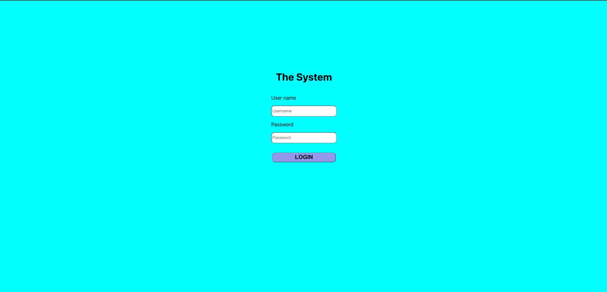
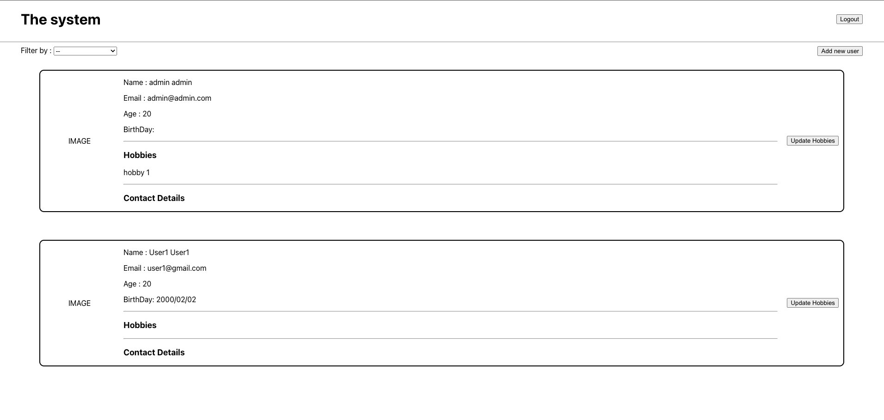
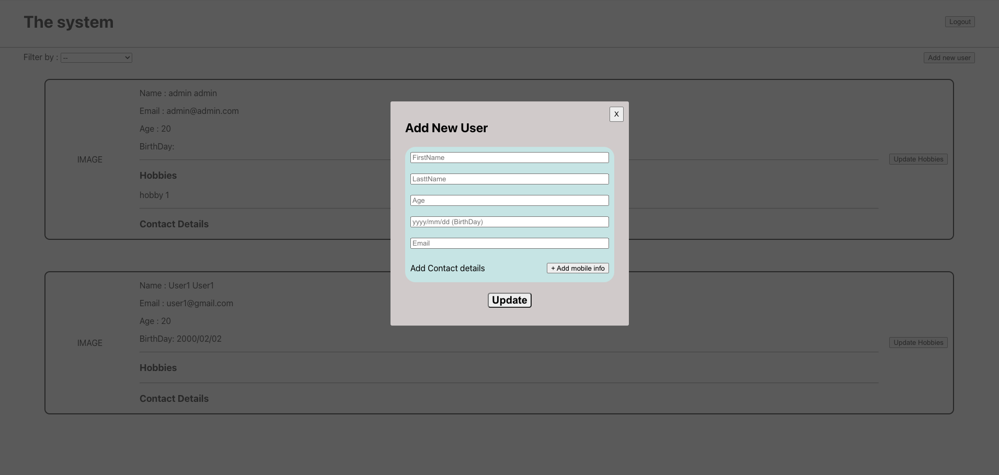
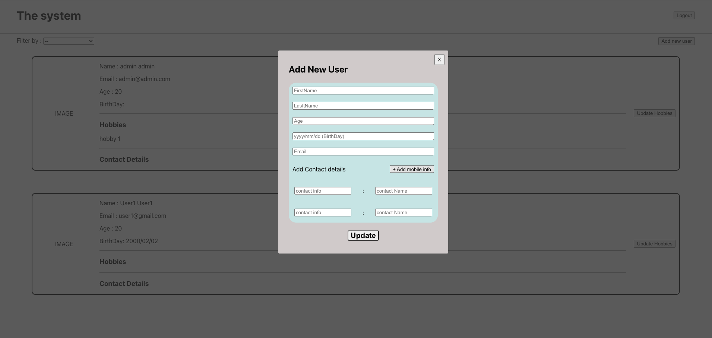
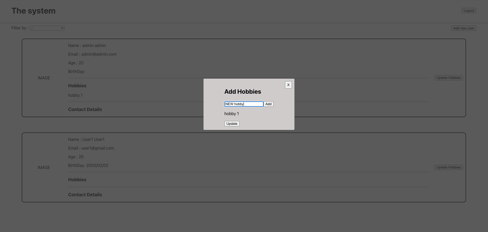
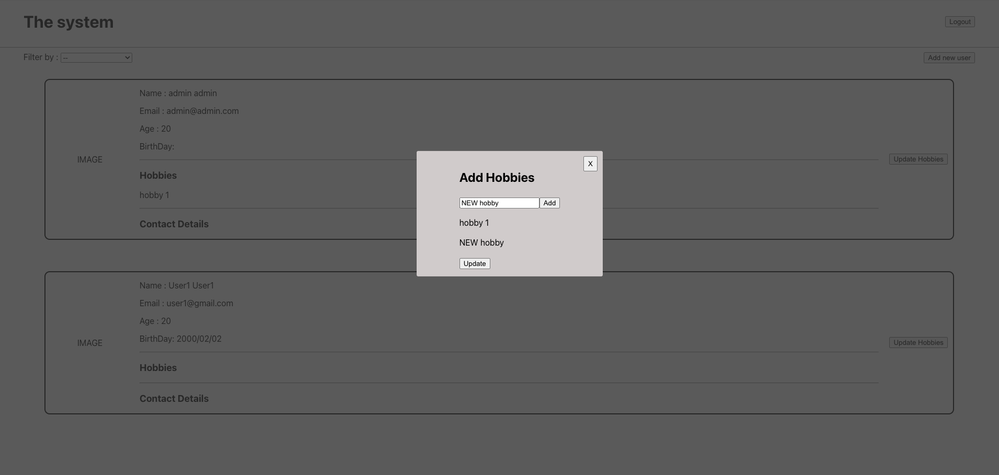
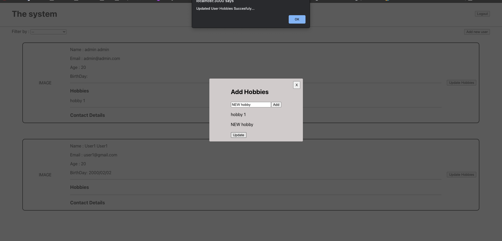
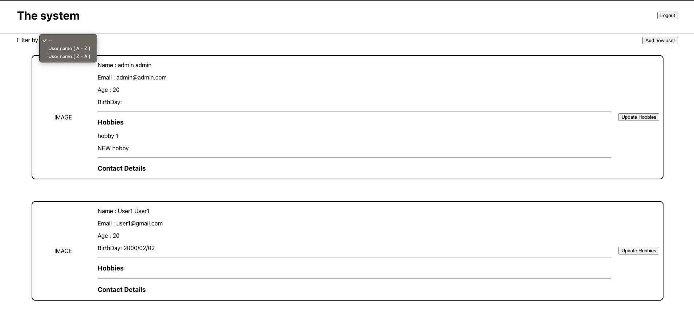

## HOW to run?

- First run the api.
- Then run "npm run start" on this project root directory.

## how to login first time?

- Admin user is already created from the Api.

* Username - admin@admin.com
* Password - admin

## What can you do?

- All the users that are added to this system will be shown when logged in.
- NEW USER can be added with MULTIPLE MOBILE numbers.( read more below on "New User" part)
- Initially hobbies cannot be added but For Each user we can add hobbies. ( read more below on "How to add hobbies" part)
- Users can be filted from their First name. (A-Z and Z-A).
- Finally a user can logOut.

## What I haven't DONE ???

- Validations for user email and Name are not added.

## New User

- To login from a new user. use the following convention.

* UserName - Email (email entered while creating the user)
* Password - FirstName@123 ( Users First name followed by "@123").

## How to add hobbies

- Open the add hobbies view. ("Update Hobbies" Button)
- Enter a hobby you want to add.
  - Then click "Add" button.
  - Then you can see that new hobby appeard below that.
  - Add as many as hobbies you like.
  - All duplicated hobbies will be not added to hobbies tabel but it will be added to that user.
  - After clicking on "Update" button it will be updated and saved in database.

## Screenshots of the views

